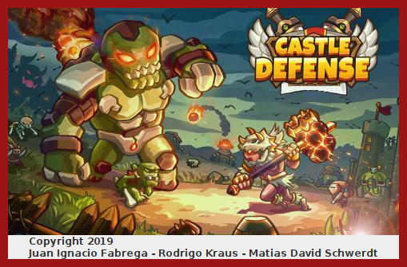
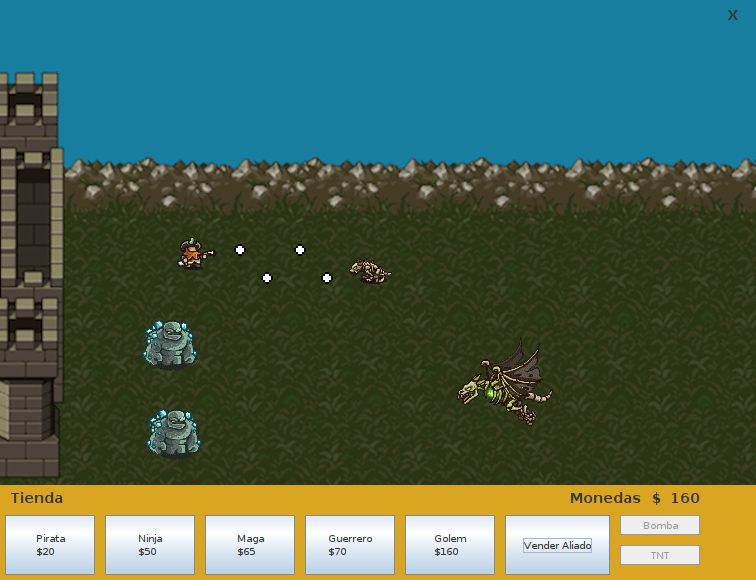
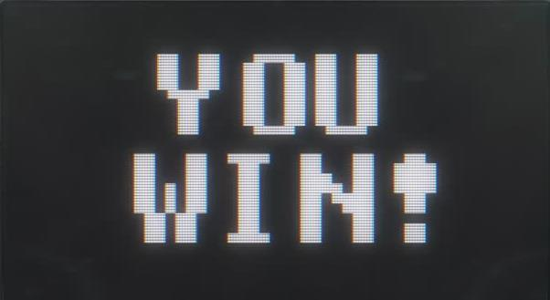
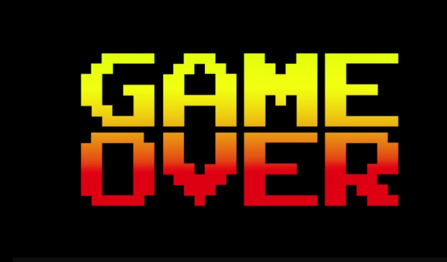

# Castle Defense

Castle Defense is a Tower Defense video game developed as a project for the "Tecnologia de programacion" subject at Universidad Nacional del Sur (UNS). It is written in Java and aims to provide an engaging gaming experience.

## Run Locally

Clone the project

```bash
  git clone https://github.com/juanifabrega/Castle-Defense
```

Go to the executable directory

```bash
  cd Castle-Defense/Ejecutable
```

Run the executable. You need Java 8 or either

```bash
  java -jar Castle-Defense__java8.jar
```


## Authors

- [@matichewer](https://www.github.com/matichewer)
- [@rodrikraus](https://www.github.com/rodrikraus)
- [@juanifabrega](https://www.github.com/juanifabrega)


## Screenshots










